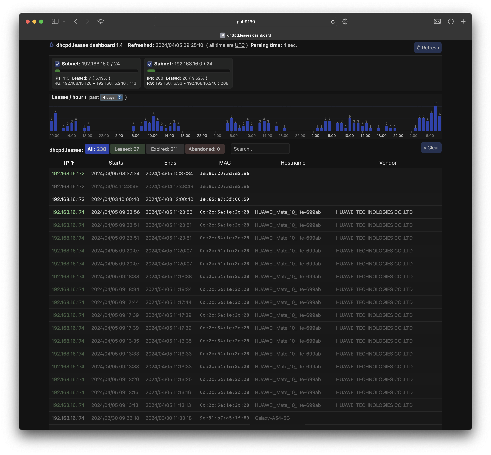
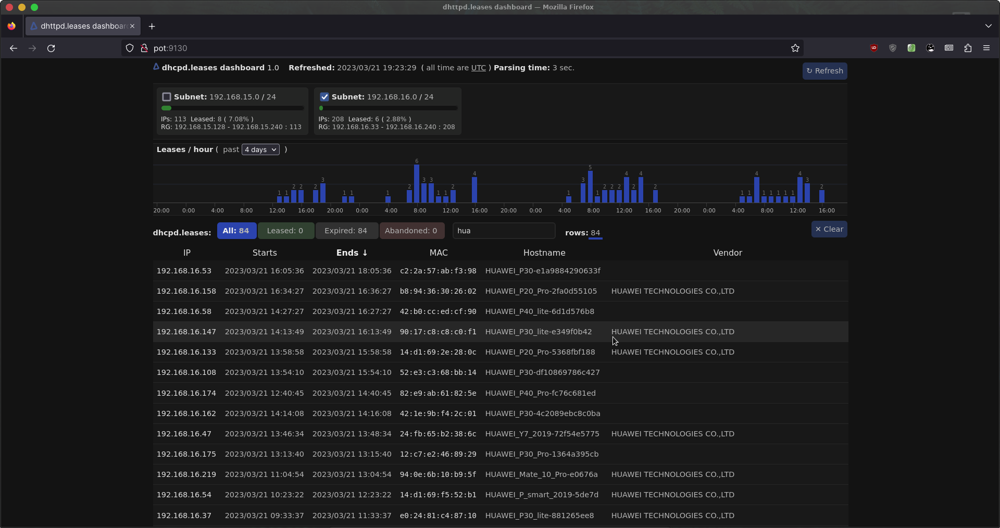
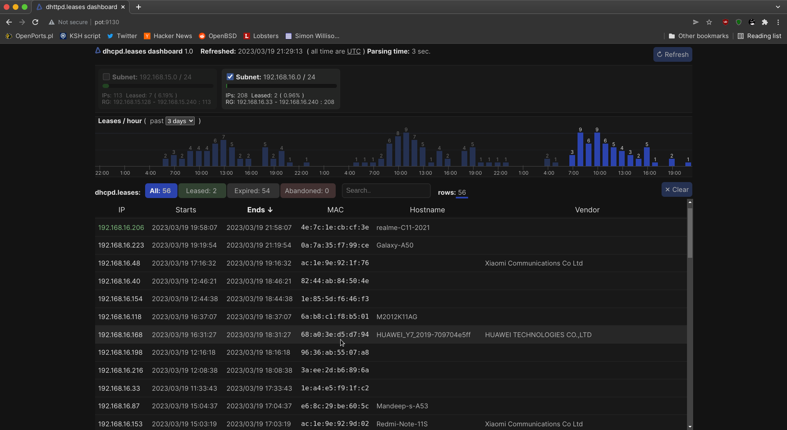

# dhcpd.leases dashboard
I was looking for a simple way to monitor the `dhcpd(8)` leases, subnet utilization
and generally the state of the `OpenBSD` dhcpd server but I couldn't find any
tool suitable for my needs. Most options are an overkill for the small APU 
routers that I need it for. So I made this:  
A simple dashboard for the `dhcpd.leases` file of the OpenBSD dhcpd server
that is very easy to deploy and use.  
Basically all this dashboard does is present the data in dhcpd.leases plus some
data from `dhcpd.conf` (currently only subnets and ranges) in a user friendly way
including full dynamic searching, filtering and sorting.
It can easily handle a few class C subnets or more, depending on your HW. 

- Pure sh script. Runs on a base OpenBSD installation with no dependancies.
- Javascript and styles can be merged into the script to create a single file 
  server or cgi script that is easy to deploy. This is the preferred way of 
  using this script.
- Can optionally do MAC address Vendor lookup using the standards-oui.ieee.org 
  data. Please note that Vendor lookup adds a lot to the processing time.
- Filtering, sorting and searching in the browser.
- Requires read access to /var/db/dhcpd.leases and /etc/dhcpd.conf files.
- Can be safely started from rc.local (V1.2)


Safari on macOS


Firefox on OpenBSD


Iridium (Chromium) on OpenBSD


## Installation
```
$ git clone https://github.com/facelessfish/dhcpd-leasesd (or Code/Download zip
and unzip)
$ cd dhcpd-leasesd
$ chmod +x dhcpd-leasesd
$ ./dhcpd-leasesd -dv -l <ip address to listen>
```
On first run (or after a reboot or after /tmp is cleared by the system)
it will download the OUI data and cache it in /tmp if -v is specified.
Wait for the download to finish and then visit:
`http://<ip address>:9130` with a fairly recent browser.  
Tested on Safari, Firefox and Chromium.

### To generate, install and start the single file server:
```
$ ./dhcpd-leasesd -f dhcpd-leasesd.sh
$ mv dhcpd-leasesd.sh /usr/local/sbin/
$ dhcpd-leasesd.sh -dv -l <ip address to listen> -p <port>
```

## The dashboard can be served in 2 (+1) ways.

  - Using the builtin `nc(1)` "HTTP server".  
    This the easiest way to run the dashboard. Please note that it has a 
    serious limitation of only 1 concurrent request (server is unavailable 
    during processing).  
    ex.
    ```
    $ dhcpd-leasesd -dv -l 192.168.0.1
    ```
    o start it in the background:
    ```
    $ dhcpd-leasesd -dv -l 192.168.0.1 &
    ```

  - Using `tcpserver(1)`.  
    This option requires the ucspi-tcp package which contains the tcpsrver. 
    Most flexible option due to the tcpserver configuration options. Can easily
    handle any number of concurrent requests.  
    ex.
    ```
    $ tcpserver 192.168.0.1 9130 dhcpd-leasesd.sh -tv
    ```
  - As a `slowcgi(8)` script for `httpd(8)`.  
   It should be possible to run it as a cgi but i didnt test it as it looks
   like more trouble than its worth.  
   At the very least the following commands will need to be copied to /bin in the 
   /var/www/ chroot:  
   cat, date, grep, mkdir, mkfifo, nc, printf, rm, sh, tr, wc, pkill, pgrep  
   and then you'll have to copy ( and periodically update ) dhcpd.leases and
   dhcpd.conf to somewhere in the chroot.


## Usage
```
dhcpd-leasesd [-b dhcpd.leases] [-c dhcpd.conf] [-t] [-v] [-u] [-f out_file] 
              [-d [-l listening_ip_address] [-p port]] 

Run without options will output HTML on stdout and exit.

-d Run as a deamon using the nc http server. Can only serve one request at a 
   time. -t is ignored (always on).

-l Listening address. Used only with -d. Default: 127.0.0.1

-p Listening port. Used only with -d. Default: 9130

-v Enable MAC address vendor lookup. Oui db will be downloaded and cached into
   /tmp if not already cached.

-t Prepend an HTTP 200 header to the HTML output. Needed when used with 
   tcpserver.

-b Path to dhcps.leases. Default: /var/db/dhcpd.leases

-c Path to dhcpd.conf. Default: /etc/dhcpd.conf

-u Update the vendor database and exit. All other options are ignored.

-f Merge the sh script, javascript and styles into out_file and exit. All other
   options are ignored.

-k kill the script if running in the background and exit.

Examples:
  $ dhcpd-leasesd.sh -d

  $ dhcpd-leasesd.sh -dv -b ./dhcpd.leases -c ./dhcpd.conf -l 0.0.0.0 -p 9130

  $ dhcpd-leasesd -f out.sh 

  $ tcpserver 192.168.0.1 9130 dhcpd-leasesd.sh -tv

```


## Changelog

### V1.4
- graph: alternate color of hour labels (per day).
- added option -k to kill the script if its running in the background. Makes it easy to upgrade.
- fixed wheel scroll event (mousewheel is deprecated)

### V1.3
- fixed a bug where the first bar of the bargraph would not show
- improved handling of renewed leases
- More code cleanup & bug fixes

### v1.2
- Better handling of background OUI db download.
- UI improvements and code cleanup.
- Visually indicate renewed active leases.
- Starts fine from rc.local (diabled text output if not run from a terminal)
